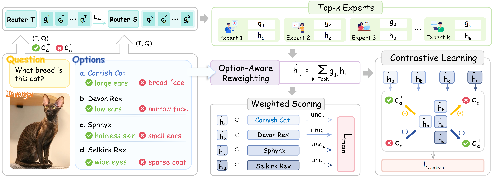

# CoGR-MoE (Open Source Layout)

**CoGR-MoE: Concept-Guided Expert Routing with Consistent Selection and Flexible Reasoning for Visual Question Answering**

**Venue:** ACL 2026 Findings



## 1) Create Environment

```bash
cd CoGR-MoE
python -m venv .venv
source .venv/bin/activate
pip install -U pip
pip install -r requirements.txt
```

Optional: prepare environment variables via file:

```bash
cp .env.example .env
# Edit .env and set OPENAI_API_KEY, etc.
```

Or export directly:

```bash
export OPENAI_API_KEY=your_key_here
```

---

## 2) Data Preparation (MRAG)

### 2.1 Generate strict non-overlap train/eval TSV (recommended)

```bash
python scripts/prepare_mrag_20_tsv.py
```

Default outputs:

- `MRAG-Bench/mrag_20_for_vmc/data/tsv/VMCBench_DEV.tsv` (from `train_indices`)
- `MRAG-Bench/mrag_20_for_vmc/data/tsv/VMCBench_TEST.tsv` (from `test_indices`)

Also writes `split_meta.json` with mode `strict_non_overlap_20_80`.

### 2.2 Generate 80% eval pool TSV (eval-only)

```bash
python scripts/prepare_mrag_80_tsv.py
```

---

## 3) Probe Generation

Training scripts validate probe coverage before training:

- Probes must be complete before training starts.
- If probes are incomplete, training will fail immediately (no auto-generation during training).

You can also pre-generate probes offline.

### 3.1 Generic VMC probes (OpenAI pipeline)

```bash
python scripts/pregenerate_probes.py \
  --data_path ../../VMCBench \
  --split dev \
  --output probes_train.jsonl
```

### 3.2 MRAG probes (OpenAI pipeline)

```bash
python scripts/pregenerate_probes.py \
  --data_path ../../MRAG-Bench/mrag_20_for_vmc \
  --split dev \
  --output probes_mrag_train.jsonl
```

---

## 4) Training

### 4.1 MRAG main pipeline (Stage1 LoRA -> Stage2 CoGR)

```bash
python scripts/train_mrag.py \
  --train_stage both \
  --data_path ../../MRAG-Bench/mrag_20_for_vmc \
  --base_model_path llava-hf/llava-1.5-7b-hf \
  --lora_output_dir ./mrag20_lora_out \
  --cogr_output_dir ./mrag20_cogr_out
```

Key outputs:

- Stage1 LoRA: `mrag20_lora_out/best_lora/`
- Stage2 CoGR module: `mrag20_cogr_out/cogr_modules.pt`
- VMC checkpoint (Google Drive): [Direct Download](https://drive.google.com/file/d/16S_zO2eo5qK2YT7dNvkcu4P3CZfm91Bw/view?usp=drive_link)

### 4.2 VMC main pipeline (Stage1 LoRA -> Stage2 CoGR, dev-only training)

```bash
python scripts/train_vmc_staged.py \
  --train_stage both \
  --data_path ../../VMCBench \
  --base_model_path llava-hf/llava-1.5-7b-hf \
  --output_dir ./vmc_staged_out
```

Key outputs:

- Stage1 LoRA: `vmc_staged_out/stage1_lora/best_lora/`
- Stage2 CoGR module: `vmc_staged_out/stage2_cogr/cogr_modules.pt`
- VMC checkpoint (Google Drive): \href{https://drive.google.com/file/d/16S_zO2eo5qK2YT7dNvkcu4P3CZfm91Bw/view?usp=drive_link}{Direct Download}
---

## 5) Checkpoint Evaluation

### 5.1 VMC: evaluate LoRA + CoGR

```bash
python scripts/eval_cogr_with_modules.py \
  --base_model_path llava-hf/llava-1.5-7b-hf \
  --adapter_path ./vmc_staged_out/stage2_cogr/best_lora \
  --cogr_modules_path ./vmc_staged_out/stage2_cogr/cogr_modules.pt \
  --data_path ../../VMCBench \
  --output_json ./eval_vmc.json
```

Note: `scripts/eval_cogr_with_modules.py` now evaluates on the **test** split by default.

### 5.2 MRAG: evaluate LoRA + CoGR

```bash
python scripts/eval_cogr_with_modules.py \
  --base_model_path llava-hf/llava-1.5-7b-hf \
  --adapter_path ./mrag20_cogr_out/best_lora \
  --cogr_modules_path ./mrag20_cogr_out/cogr_modules.pt \
  --data_path ../../MRAG-Bench/mrag_80_for_vmc \
  --output_json ./eval_mrag80.json
```

### 5.3 Per-category evaluation

```bash
python scripts/eval_vmc_per_category.py \
  --base_model_path llava-hf/llava-1.5-7b-hf \
  --adapter_path ./mrag20_cogr_out/best_lora \
  --data_path ../../MRAG-Bench/mrag_80_for_vmc \
  --split test
```

---

## Citation

```bibtex
@inproceedings{
anonymous2026cogrmoe,
title={Co{GR}-MoE: Concept-Guided Expert Routing with Consistent Selection and Flexible Reasoning for Visual Question Answering},
author={Anonymous},
booktitle={The 64th Annual Meeting of the Association for Computational Linguistics},
year={2026},
url={https://openreview.net/forum?id=fct9C0uOA6}
}
```
